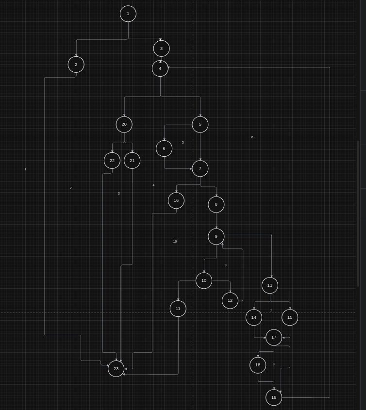
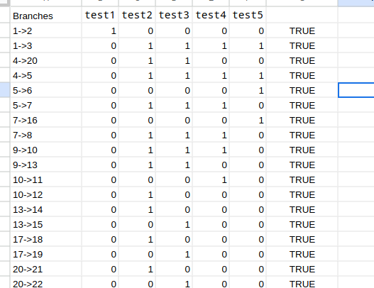
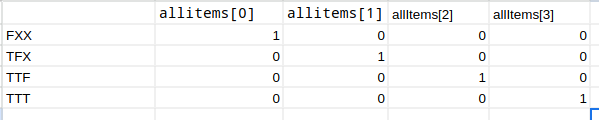

# Виктор Христовски 226026 

## CFG graph 

## Цикломатска комплексност 
- Цикломатската комплексност е 10, бидејќи имаме 9 предикатни јазли или имаме 10 региони или имаме 31 ребро, 23 јазли 

## Every branch 
- allItems=null, payment = 0 
- allItems=({discount=10,price=301,barcode=0,name=a}), payment=300
- allitems=({name=a,barcode=123,price=300,disc=0}), payment = 200
- allitems=({bardoce=ab,price=0,discount=0,name=a}), payment = 0
- allitems=({barcode=null,price=0,discount=0,name=""}), payment = 0 

## Multiple conditions 
- allItems=(
    {price=100,barcode=1,name=a,discount=0},
    {price=301,discount=0,barcode=1,name=a},
    {price=301,discount=1,barcode=1, name=a}, 
    {price=301,discount=1,barcode=0, name=a}
) , payment = 100

